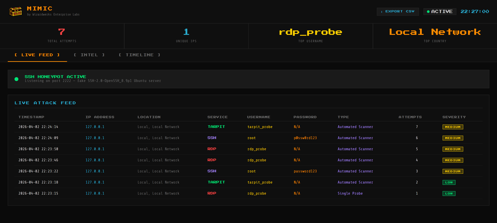
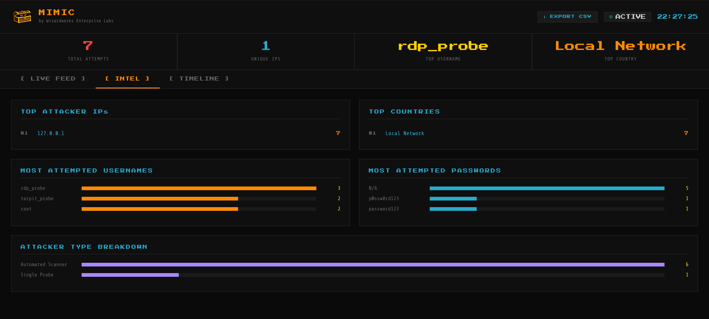
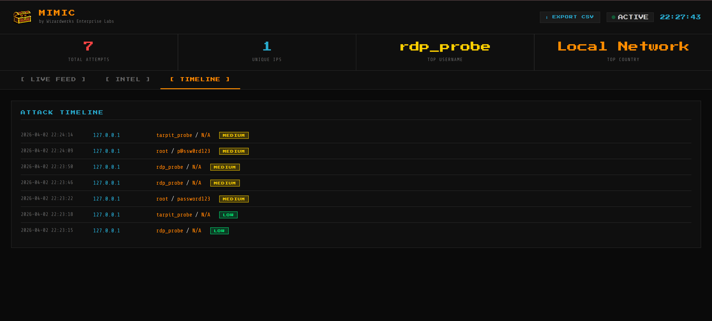

**By Wizardwerks Enterprise Labs**

---

Mimic is a multi-service honeypot framework and deception engine built in Python and Flask. It deploys fake SSH, FTP, Telnet, and RDP services that lure attackers into revealing their credentials, tactics, and origins — all captured in real time on a unified web dashboard. Part of the [Arcane Defense Suite](https://github.com/JMitchTech/Arcane-Defense-Suite).


---

## Screenshots

### Live Feed

*Real time attack feed showing service, credentials, attacker type, and severity per attempt.*

### Intel

*Attacker intelligence — top IPs, countries, most attempted usernames and passwords.*

### Timeline

*Full chronological attack timeline with credential pairs and severity badges.*

---

## Features

### Honeypot Services
- **SSH** (port 2222) — mimics a real Ubuntu OpenSSH server
- **Telnet** (port 23) — fake Ubuntu login prompt
- **FTP** (port 21) — fake Microsoft FTP service
- **RDP** (port 3389) — fake Windows Remote Desktop endpoint
- **Tarpit** (port 9999) — accepts connections and drips data to waste attacker resources

### Live Dashboard
- Real time attack feed with color coded service indicators
- Auto-refreshing stats — total attempts, unique IPs, top username, top country
- Threshold alerts — toast notifications at MEDIUM (3), HIGH (10), and CRITICAL (20) attempts per IP

### Attacker Intelligence
- IP geolocation — country, city, and ISP per attacker
- Attacker type classification — Single Probe, Automated Scanner, Brute Force, Credential Stuffing, Targeted Attack
- Top attacker IP leaderboard
- Most attempted username and password charts
- Attacker type breakdown

### Data Management
- Persistent logging — attacks survive restarts via JSON storage
- Persistent SSH host key — no more known_hosts warnings on restart
- CSV export — download full attack log
- Log clear endpoint for fresh sessions

---

## Tech Stack

| Layer      | Technology                      |
|------------|---------------------------------|
| Backend    | Python 3.10+, Flask 3.0         |
| Realtime   | Flask-SocketIO + threading      |
| SSH Engine | Paramiko                        |
| Geolocation| ip-api.com (free tier)          |
| Frontend   | Vanilla HTML/CSS/JS             |
| Fonts      | Press Start 2P, Share Tech Mono |

---

## Installation
```bash
pip install -r requirements.txt
```

## Running Mimic

> ⚠️ Run as Administrator for full port access (ports 21, 23, 3389 require elevated privileges).
```cmd
python app.py
```

Open your browser to: **http://127.0.0.1:5002**

Note: Mimic runs on port **5002** to run alongside Spellcastr (5000) and Grimoire (5001).

---

## Project Structure
```
mimic/
├── app.py                  # Flask application
├── requirements.txt
├── README.md
├── templates/
│   └── index.html          # Single-page dashboard
├── static/
│   └── images/
│       ├── mimic_icon.png  # App logo
│       └── mimic_banner.png # Repo banner
├── logs/
│   └── attacks.json        # Persistent attack log
├── data/
│   └── host_key.key        # Persistent SSH host key
├── Screenshots/            # App screenshots
└── utils/
    ├── __init__.py
    ├── honeypot.py         # Multi-service honeypot engine
    ├── analyzer.py         # Attacker classification and threshold engine
    └── geoip.py            # IP geolocation
    ```

    ---

## Ethical & Legal Notice

This tool is intended for use on systems and networks you own or have explicit permission to monitor. Deploying honeypots on networks you do not own or administer may violate computer fraud laws including the Computer Fraud and Abuse Act (CFAA).

---

*Built by Wizardwerks Enterprise Labs*